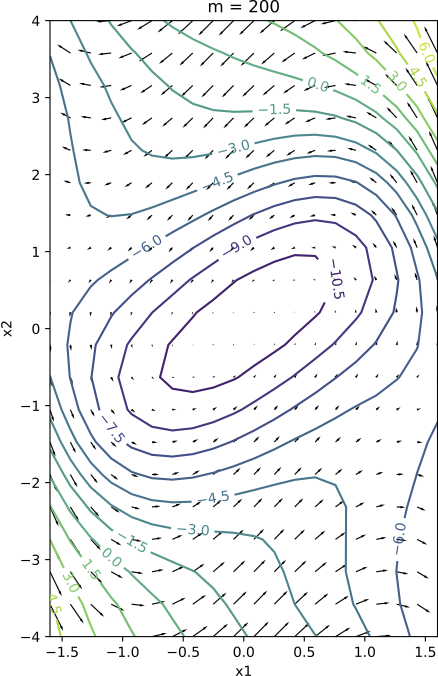
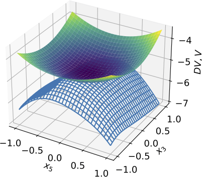
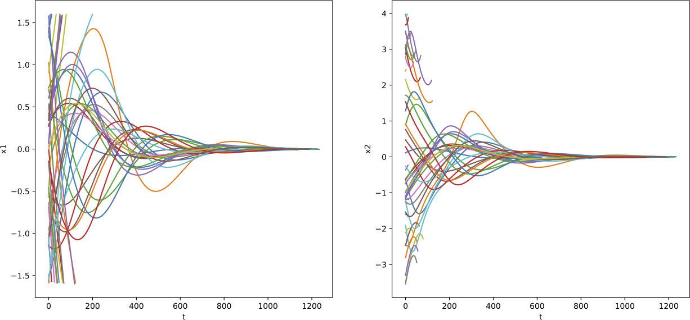
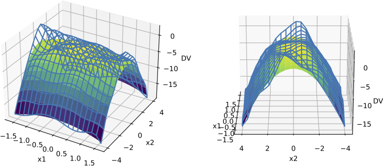
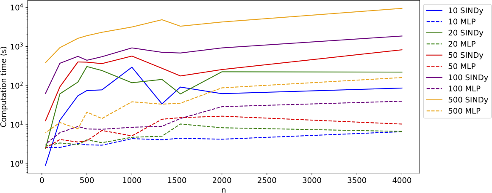

# Neural Networks for Lyapunov Function Approximation using Time Series Data

This repository consists of all the source code for my Master thesis at Imperial College London. This is part of the [MSc in Statistics (Data Science)](https://www.imperial.ac.uk/mathematics/postgraduate/msc/statistics/prospective/msc-statistics-data-science/) program from the Department of Mathematics. My Supervisor was [Dr. Kevin Webster](https://www.imperial.ac.uk/people/kevin.webster).

## Thesis Abstract

We study the application of Neural Networks for Lyapunov function approximations on time-series data. We present the connection between the meshless collocation method and neural networks for computing Lyapunov functions and explore the existing state-of- the-art neural network architectures. Departing from the assumption of having access to the evolution equations of a dynamical system, we introduce a method that approximates the Lyapunov function from time series data. To do this, we approximate the evolution equations from time series using both a Sparse Identification of Nonlinear Dynamics method and a Deep Neural Network method, comparing computational complexities and accuracies. It is clear that the Deep Neural Network method is better in generalising to higher dimensions, in agreement with existing literature. We conclude with an end-to- end model that can approximate Lyapunov functions from unseen time series data, and we demonstrate that for large dimensional systems, we achieve a mean squared error almost identical to the models that access the true equations.

## Usage

Install required packages in new environment:

```
python3 -m venv my_venv
source my_venv/bin/activate
pip install -r requirements.txt
```

1. `get_vector_field.py` : This program defines the vector field of equations that
are used for the experiments performed. Add any new functions
here if required.

2. `build_DS.py` : This program simulates the time series from a dynamical system
and approximates the evolution equations using either SINDy or 
a Multi-Layer-Perceptron model.
3. `NN_Lyapunov.py` : Main program that runs the Lyapunov functions approximation 
using Neural Networks
4. `multiple_approximation_runs.py`: Program that runs SINDy and MLP methods for different 
number of datapoints and trajectories for the Van der Pol
5. `run_models.py` : This program runs the model from end-to-end. Toggle any parameters you want 
to change from this program. Default parameters run the 2-d Van der Pol equation.
6. `crop_plots.sh` : Helper executable script that crops all pdf figures within directory 

`Experiments\` includes some experiments shown in the thesis for the model that has access to the true evolution equations.  `Experiments2\` includes the runs for the MLP and SINDy methods (end-to-end models). `Notebooks` are the Jupyter Notebooks used mostly for plotting the runs. `Final_Plots` are the figures included in the thesis.

For running a simple example of the Van der Pol Equation: 

```
python run_models.py
```

## Example Results









